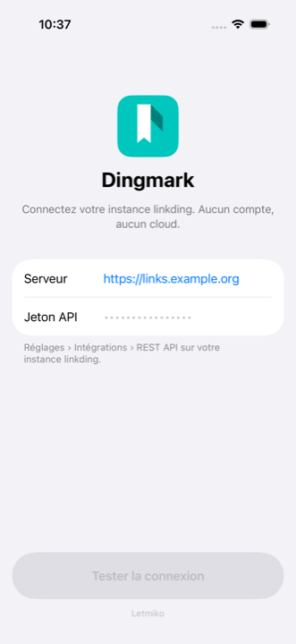
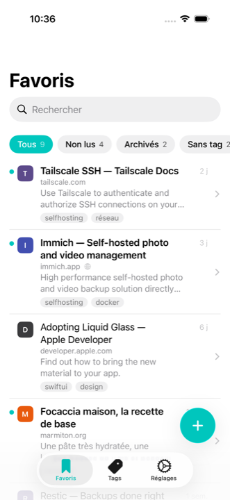
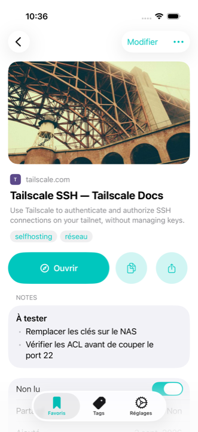
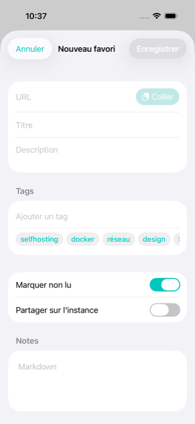
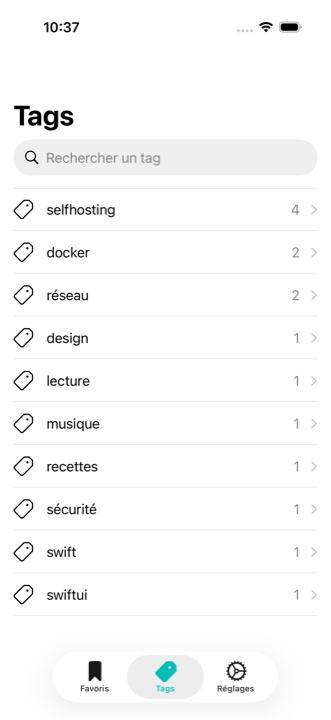
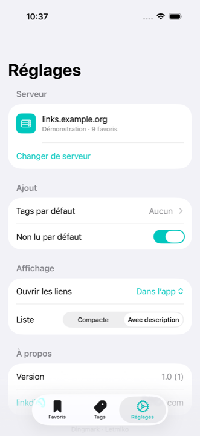
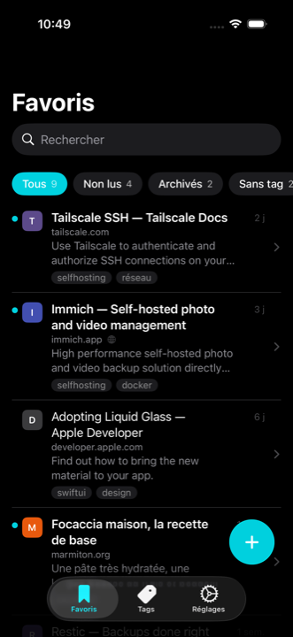
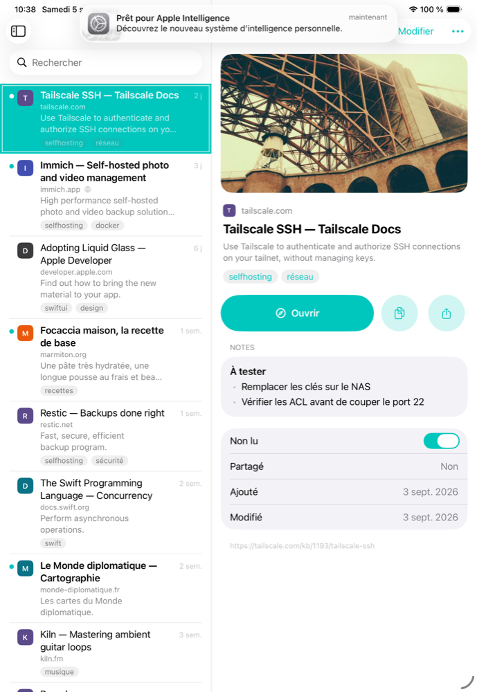

# Dingmark

A native iOS and iPadOS client for [linkding](https://github.com/sissbruecker/linkding), the self-hosted bookmark manager.

Dingmark talks to your own linkding server and to nothing else. No account, no cloud, no analytics: your bookmarks never leave the server you run.

| Sign in | Bookmarks | Detail | Add |
|---|---|---|---|
|  |  |  |  |

| Tags | Settings | Dark | iPad |
|---|---|---|---|
|  |  |  |  |

## Features

- **Bookmarks list** with search, quick filters (all, unread, archived, untagged) and per-tag filtering. Search and filters run on a local cache, so they work offline.
- **Detail** with Markdown notes, tags, unread toggle, in-app Safari or system Safari, copy and share.
- **Add and edit** with a paste button, metadata fetched from your server (title, description, suggested tags) and a duplicate check required before saving: adding a URL you already saved updates that bookmark instead of creating another.
- **Share extension**: save any page from Safari or another app in two taps, with your default tags.
- **Widgets**: unread bookmarks on the Home Screen and the Lock Screen, with an add shortcut.
- **iPad**: three-column layout (filters and tags, list, detail).
- **Offline**: the last confirmed server state stays readable; changes appear immediately in the app and are rolled back if the server refuses them. Pending changes are not stored in the offline cache.
- **Self-signed certificates**: refused by default, then trusted per server after you confirm the certificate fingerprint.
- French and English.

## Requirements

- iOS or iPadOS 26.0 or later.
- A linkding instance you can reach from the device, with its REST API enabled (any recent version; the duplicate check uses `/api/bookmarks/check/`). Plain HTTP is accepted for servers on your local network.

## Getting started

1. Install Dingmark. The app is free; the App Store link will be added here once it is published.
2. In linkding, open **Settings › Integrations › REST API** and create an API token.
3. In Dingmark, enter your server address (`links.example.org`, or a full URL such as `https://home.example.org/linkding`) and paste the token. **Test Connection** checks both, then the app loads your bookmarks.

If your server uses a self-signed certificate, the sign-in screen offers to trust it after the first failed attempt. If it speaks plain HTTP on your local network, type the address with `http://`.

## Privacy

Dingmark sends requests only to the linkding server you configure. It has no analytics, no crash reporting, no third-party SDK. The API token is stored in the Keychain and shared with the extensions through an App Group; it never appears in preferences or logs. The app's privacy manifest (`Dingmark/PrivacyInfo.xcprivacy`) declares no tracking and no data collection.

## Building from source

Requirements: Xcode 26 with the iOS 26 SDK, [XcodeGen](https://github.com/yonaskolb/XcodeGen) (`brew install xcodegen`).

`project.yml` is the source of truth; `Dingmark.xcodeproj` is generated from it and committed so that Xcode Cloud can build the project. Run `xcodegen` after cloning, after editing `project.yml`, and whenever Swift files are added or removed, then commit the regenerated project with your change.

```sh
xcodegen
open Dingmark.xcodeproj
```

To build for a device, put your Apple Developer team in a local, git-ignored signing file:

```sh
cp Config/Signing.local.xcconfig.example Config/Signing.local.xcconfig
# edit DEVELOPMENT_TEAM in Config/Signing.local.xcconfig
```

The simulator needs no team. Demo mode serves the eleven bookmarks of the design prototype without a server: launch the app with the `-demo` argument (or `DINGMARK_DEMO=1` in the environment). Previews, screenshots and UI tests use it.

```sh
# Debug build for the simulator
xcodebuild -project Dingmark.xcodeproj -scheme Dingmark \
  -destination 'generic/platform=iOS Simulator' -configuration Debug build

# unit tests
xcodebuild -project Dingmark.xcodeproj -scheme Dingmark \
  -destination 'platform=iOS Simulator,name=iPhone 17' -only-testing:DingmarkTests test

# app icon: regenerate the catalog PNGs from the SVG geometry
swift design/icon/render-icon.swift
```

## Architecture

```
Dingmark/          app (SwiftUI): screens, navigation, SFSafariViewController
DingmarkShare/     share extension (UIHostingController, medium and large detents)
DingmarkWidgets/   WidgetKit: small, medium, circular, rectangular
Shared/            compiled into the three targets
  Models/          Bookmark, API DTOs, linkding date decoding
  API/             LinkdingAPI (protocol), LinkdingClient (URLSession), TLS trust
  Storage/         App Group, Keychain (token), JSON cache, settings keys
  Store/           Session, BookmarkStore (optimistic updates), form model
  UI/              components: row, chips, tag field, FlowLayout, vector icon
  Demo/            prototype fixtures and in-memory client
DingmarkTests/     unit tests (Swift Testing): mocked client, decoding, filters, tags
DingmarkUITests/   screenshots and exploratory flows (demo, iPad, real server)
Config/            signing xcconfig (the local team file is git-ignored)
scripts/           seed-linkding.py: seeds a throwaway linkding for RealServerTests
design/icon/       SVG sources of the icon and the rendering script
```

Design choices:

- **Apple technologies only**: SwiftUI, Observation, WidgetKit, App Groups, Keychain, URLSession, SafariServices. No third-party dependency.
- **System components first**: `List(.plain)`, `.searchable`, `.swipeActions`, `.contextMenu(preview:)`, `ContentUnavailableView`, `.redacted`, `NavigationSplitView`, `Tab`, `.glassProminent`. Three custom views, because no system control covers them: the filter bar (scrolling, counters), the tag field (removable chips, suggestions) and the `SFSafariViewController` wrapper.
- **Safe form writes**: URL changes immediately invalidate duplicate data. Saving waits for a successful check of the current URL; failed checks do not become creates. Edits send only changed fields. Empty/default create fields are omitted where possible, but the linkding API does not offer an atomic create-if-absent operation across devices.
- **Complete snapshots**: a pagination limit or an empty intermediate page is reported as an incomplete sync and leaves the confirmed cache intact.
- **Ordered optimistic updates**: list actions and form edits appear immediately. Writes to the same bookmark run in order; a failed write rolls back only its own change, preserving later actions. Creates also wait for earlier writes because linkding may return an existing bookmark for a duplicate URL.
- **Refresh and session isolation**: refreshes wait for pending writes and retry if a write overlaps a fetched snapshot. Signing out cancels pending work and invalidates late responses, including open forms. The cache and widgets contain confirmed server values only.
- **Cache in the App Group**: a file lock coordinates app and extension transactions. Confirmed mutations merge into the latest disk snapshot; refreshes retry if another writer changes it. The app reloads the cache before a foreground refresh, including offline. A login identity rejects late writes from a signed-out extension.
- **Token in the Keychain**, shared through the App Group, never in preferences or logs.
- **Self-signed certificates**: refused by default; the sign-in screen shows the SHA-256 fingerprint before approval, and the previous fingerprint when it changes. Images on the configured server use the same approved certificate; external images retain system trust and receive no API token.

## linkding API used

`GET/POST /api/bookmarks/`, `GET /api/bookmarks/archived/`, `PATCH/DELETE /api/bookmarks/<id>/`, `POST /api/bookmarks/<id>/archive/` and `unarchive/`, `GET /api/bookmarks/check/?url=`, `GET /api/tags/`, with the `Authorization: Token <token>` header.

## Tests

The Xcode Cloud workflow runs the `Dingmark` scheme's tests on an iPhone 17 simulator using the selected Xcode's default iOS runtime. The test action is required to pass for the workflow to succeed. Server integration tests are skipped unless a throwaway linkding is configured; iPad-only tests are skipped on iPhone.

- **Unit tests** (`DingmarkTests`, Swift Testing): API client against a mocked `URLProtocol`, JSON and date decoding, filters, tag logic, form model. Form, cache, session and store regression tests cover duplicate races, failed credential storage, exact certificate approval, concurrent cache writers and login isolation. Store regression tests explicitly control the order of network responses to cover rapid actions, rollback, refresh races, duplicate creation, cancellation and session changes without timing-dependent sleeps.
- **Screenshots** (`ScreenshotTests`): the demo app in light, dark and English, plus the sign-in screen. Regenerate with `-only-testing:DingmarkUITests/ScreenshotTests` and export the attachments with `xcrun xcresulttool export attachments`.
- **Exploratory UI flows**, one screenshot per step: `ExploratoryDemoTests` (iPhone, demo data), `ExploratoryPadTests` (split view, skipped on iPhone) and `RealServerTests`, which exercises sign-in, pagination, every mutation and the share extension against a real linkding and checks the server state through the API. It is skipped unless a server is configured:

```sh
docker run -d --name linkding-test -p 9090:9090 \
  -e LD_SUPERUSER_NAME=test -e LD_SUPERUSER_PASSWORD=test sissbruecker/linkding
# API token: linkding's ApiToken model (drf_create_token produces a token the API rejects)
docker exec linkding-test python manage.py shell -c "from bookmarks.models import ApiToken; \
  from django.contrib.auth import get_user_model; \
  print(ApiToken.objects.create(user=get_user_model().objects.get(username='test'), name='tests').key)"
export DINGMARK_TEST_SERVER=http://127.0.0.1:9090 DINGMARK_TEST_TOKEN=<token>
python3 scripts/seed-linkding.py
TEST_RUNNER_DINGMARK_TEST_SERVER=$DINGMARK_TEST_SERVER TEST_RUNNER_DINGMARK_TEST_TOKEN=$DINGMARK_TEST_TOKEN \
  xcodebuild -project Dingmark.xcodeproj -scheme Dingmark \
  -destination 'platform=iOS Simulator,name=iPhone 17' \
  -only-testing:DingmarkUITests/RealServerTests test
```

The simulator reaches `127.0.0.1` directly. The tests run in name order: `test01` signs in, `test05` signs out.

## Design

The screens follow a design prototype made with Claude Design (clickable prototype, spec boards, the "Ribbon" icon). Tokens: teal accent `rgb(0,199,190)` in light and `rgb(0,210,224)` in dark, system semantic colours, Dynamic Type text styles, 16 pt margins, 26 pt group radius, 32 pt filter capsules, 50 pt filled buttons. The icon sources and their rendering script live in `design/icon/`.

## Contributing

Bug reports and pull requests are welcome. Please open an issue first for anything beyond a small fix. Contributions are accepted under the terms of the [LICENSE](LICENSE), which lets Letmiko keep shipping the app.

## License

Dingmark is source-available, not open source: you can read, audit, build and run it for yourself, and propose changes; you may not redistribute it or publish it on an app store. See [LICENSE](LICENSE).

linkding is a project by Sascha Ißbrücker, distributed under the MIT license.
